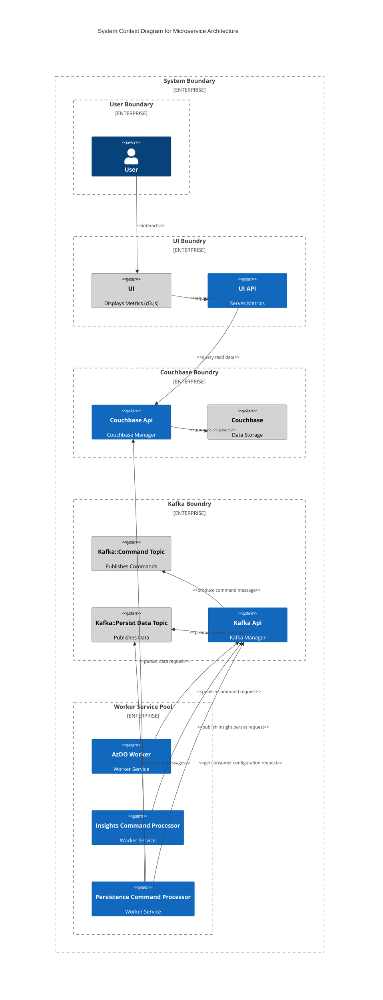

```mermaid
C4Context
  title System Context Diagram for Microservice Architecture

  Enterprise_Boundary(systemBoundry, "System Boundary") {

    Enterprise_Boundary(userBoundry, "User Boundary") {
      Person(user, "User", "")
    }

    Enterprise_Boundary(uiBoundry, "UI Boundry") {
      System(ui, "UI", "Displays Metrics (d3.js)")
      System(uiApi, "UI API", "Serves Metrics")
    }

    Enterprise_Boundary(couchbaseBoundry, "Couchbase Boundry") {
      System(couchbaseApi, "Couchbase Api", "Couchbase Manager")
      System(couchbase, "Couchbase", "Data Storage")
    }

    Enterprise_Boundary(kafkaBoundry, "Kafka Boundry") {
      System(commandTopic, "Kafka::Command Topic", "Publishes Commands")
      System(persistTopic, "Kafka::Persist Data Topic", "Publishes Data")
      System(kafkaApi, "Kafka Api", "Kafka Manager")
    }

    Enterprise_Boundary(workderServiceBoundry, "Worker Service Pool") {
      System(azdoWorker, "AzDO Worker", "Worker Service")
      System(insightsWorker, "Insights Command Processor", "Worker Service")
      System(persistWorker, "Persistence Command Processor", "Worker Service")
    }
  }

  Rel(user, ui, "<<interacts>>")
  Rel(ui, uiApi, "<<request>>")
  Rel(uiApi, couchbaseApi, "<<query read data>>")

  Rel(couchbaseApi, couchbase, "<<query>>,<<upsert>>")

  Rel(azdoWorker, kafkaApi, "<<publish command request>>")
  Rel(insightsWorker, kafkaApi, "<<publish insight persist request>>")
  Rel(persistWorker, kafkaApi, "<<get consumer configuration request>>")
  Rel(persistWorker, persistTopic, "<<consume messages>>")
  Rel(persistWorker, couchbaseApi, "<<persist data request>>")

  Rel(kafkaApi, commandTopic, "<<produce command message>>")
  Rel(kafkaApi, persistTopic, "<<produce persist message>>")

  UpdateLayoutConfig($c4ShapeInRow="3", $c4BoundaryInRow="1")

  UpdateElementStyle(ui, $fontColor="black", $bgColor="lightgray", $borderColor="black")
  UpdateElementStyle(persistApi, $fontColor="black", $bgColor="lightgray", $borderColor="black")
  UpdateElementStyle(persistTopic, $fontColor="black", $bgColor="lightgray", $borderColor="black")
  UpdateElementStyle(commandTopic, $fontColor="black", $bgColor="lightgray", $borderColor="black")
  UpdateElementStyle(couchbase, $fontColor="black", $bgColor="lightgray", $borderColor="black")
  UpdateElementStyle(kafka, $fontColor="black", $bgColor="lightgray", $borderColor="black")
  UpdateRelStyle(user, uiApi, $textColor="blue", $lineColor="blue", $offsetX="5")
  UpdateRelStyle(uiApi, persistApi, $textColor="blue", $lineColor="blue", $offsetX="5")
  UpdateRelStyle(persistApi, persistTopic, $textColor="blue", $lineColor="blue", $offsetX="5")
  UpdateRelStyle(persistTopic, persistApi, $textColor="blue", $lineColor="blue", $offsetX="-5")
  UpdateRelStyle(persistApi, couchbase, $textColor="blue", $lineColor="blue", $offsetX="-5")
  UpdateRelStyle(persistApi, commandTopic, $textColor="blue", $lineColor="blue", $offsetX="5")
  UpdateRelStyle(commandTopic, persistApi, $textColor="blue", $lineColor="blue", $offsetX="-5")
  UpdateRelStyle(persistApi, kafka, $textColor="blue", $lineColor="blue", $offsetX="-5")
  UpdateRelStyle(kafka, uiApi, $textColor="blue", $lineColor="blue", $offsetX="5")

```
